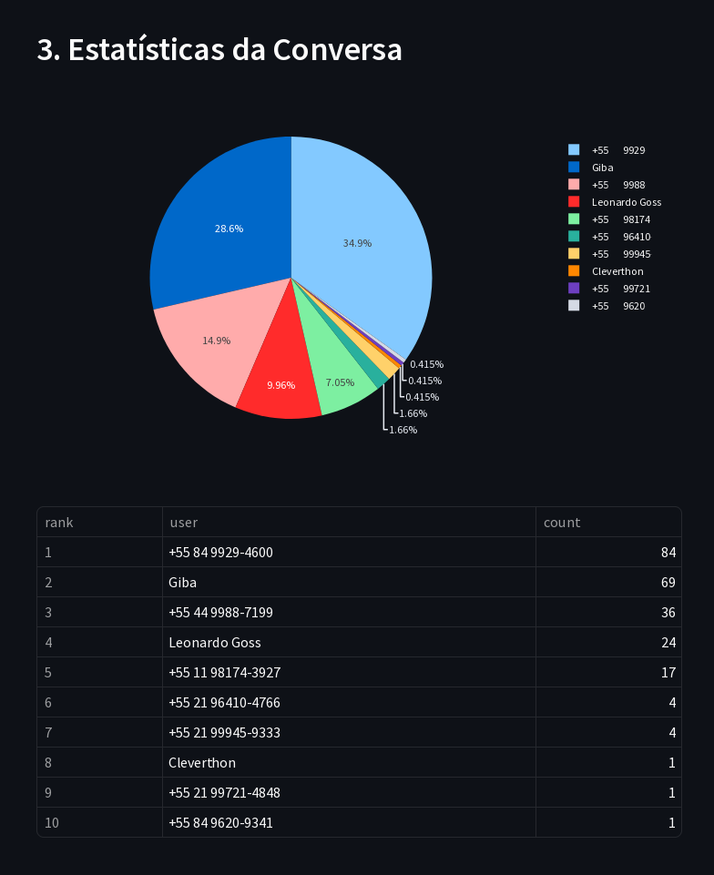
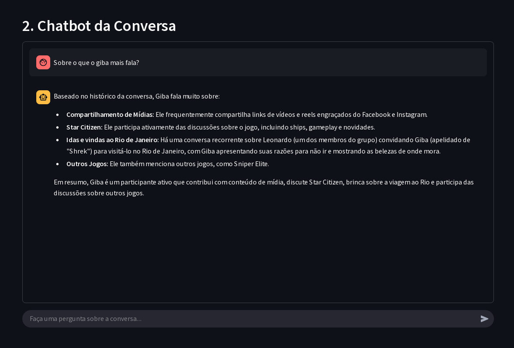

# 🤖 WhatsApp Analyzer: Análise Inteligente e Chat para Suas Conversas do WhatsApp


Este projeto oferece uma ferramenta de linha de comando (CLI) para **analisar e interagir** com conversas exportadas do WhatsApp. Transforme seus arquivos de exportação (`.zip`) em insights valiosos, visualize estatísticas sobre a participação dos usuários e use um chat inteligente para fazer perguntas diretas sobre o conteúdo das mensagens.

## ✨ Funcionalidades Principais

* **Parser de Exportação do WhatsApp:** Processa arquivos `.zip` exportados diretamente do WhatsApp, extraindo e estruturando os dados da conversa para análise.
* **Ranking de Usuários Ativos:** Identifica e exibe os 10 usuários que mais enviaram mensagens, juntamente com a contagem de mensagens e a emoção predominante detectada para cada um.
* **Análise de Sentimento por Mensagem:** Utiliza um agente de IA para classificar o sentimento de mensagens individuais, ajudando a entender o tom geral da conversa (feliz, triste, engraçado, etc.).
* **Agente de Conversação Inteligente:** Permite que você faça perguntas em linguagem natural sobre o histórico da conversa (filtrado por período) e receba respostas baseadas no conteúdo das mensagens.

## 🛠️ Pré-requisitos e Instalação

Certifique-se de ter o **Python 3.12 ou superior** instalado em seu sistema.

1. **Clone o Repositório:**

    ```bash
    git clone https://github.com/Su3h7aM/imersao-ia-alura-google.git

    cd imersao-ia-alura-google
    ```

2. **Configure a Chave da API do Google GenAI:**
    Este projeto utiliza a API do Google Generative AI (parte da Imersão IA Alura). Você precisará obter uma chave de API no [Google AI Studio](https://aistudio.google.com/).
    Defina sua chave como uma variável de ambiente:

    ```bash
    export GOOGLE_API_KEY='SUA_CHAVE_AQUI'
    ```

    *Substitua `SUA_CHAVE_AQUI` pela chave obtida.*

3. **Instale as Dependências:**
    As dependências estão listadas em `pyproject.toml`. Você pode instalá-las usando `uv` ou `pip`:

    ```bash
    uv sync
    ```

    ou

    ```bash
    pip install -r requirements.txt
    ```

## 🚀 Como Acessar e Usar

Você pode interagir com o ChatWiz de duas maneiras principais:

### 🌐 Pela Aplicação Web (Online)

A forma mais rápida de testar e usar o analisador sem precisar instalar nada é pela aplicação web construída com Streamlit.

**Exporte sua Conversa do WhatsApp:**
No aplicativo WhatsApp, exporte o histórico da conversa desejada (como arquivo `.zip`).
> **Importante**: Atualmente, o projeto **não** processa arquivos de mídia, apenas o texto da conversa.

Acesse em: [https://imersao-ia-alura-app-su3h7am.streamlit.app/](https://imersao-ia-alura-app-su3h7am.streamlit.app/)

### 🖥️ Localmente (Via CLI)

Para ter o controle total e rodar a ferramenta diretamente no seu computador.

1. **Exporte sua Conversa do WhatsApp:**
    No aplicativo WhatsApp, exporte o histórico da conversa desejada (como arquivo `.zip`).
    > **Importante**: Atualmente, o projeto **não** processa arquivos de mídia, apenas o texto da conversa.

2. **Execute o Script Principal:**
    Certifique-se de que sua chave `GOOGLE_API_KEY` está configurada nas variáveis de ambiente (veja passo 2 da instalação).
    Execute o script a partir do terminal no diretório do projeto:

    ```bash
    uv run main.py
    ```

    ou

    ```bash
    python main.py
    ```

3. **Interaja no Terminal:**
    * Ao iniciar, o script pedirá o **`Limite de dias`** para filtrar o histórico de mensagens a ser analisado e consultado.
    * Em seguida, ele exibirá o **ranking do Top 10 Usuários Mais Ativos** dentro desse período.
    * A interface de chat será liberada. Digite sua **pergunta** sobre o conteúdo da conversa (ex: "Quem falou mais sobre o projeto?", "Quando combinamos o churrasco?").
    * Digite `fim` para encerrar a sessão de chat.

## 📊 Visualizando as Estatísticas (Site)

Veja um exemplo da visualização das estatísticas geradas, incluindo o gráfico de pizza e a tabela de ranking:



## 💬 Interagindo com o Chatbot (Site)

Após as estatísticas, você pode interagir com o agente de conversa para tirar dúvidas sobre o conteúdo das mensagens dentro do período analisado.



## 📖 Exemplo de Fluxo de Uso (Terminal)

Aqui está um exemplo do fluxo completo no terminal:

```bash
uv run main.py

Carregando e processando conversa...
Limite de dias (Ex: 30): 60

Analisando dados dos últimos 60 dias...

📊 Top 10 Usuários Mais Ativos (Últimos 60 dias)
┏━━━━┳━━━━━━━━━━━━┳━━━━━━━━━━━┳━━━━━━━━━━━┓
┃Rank┃Usuário     ┃Mensagens  ┃Emoção     ┃
┡━━━━╇━━━━━━━━━━━━╇━━━━━━━━━━━╇━━━━━━━━━━━┩
│ 1  │ Alice      │ 345       │ feliz     │
│ 2  │ Bruno      │ 298       │ engraçado │
│ 3  │ Carlos     │ 210       │ neutro    │
│ 4  │ Daniela    │ 188       │ triste    │
│ 5  │ Eduardo    │ 155       │ neutro    │
│ 6  │ Fernanda   │ 120       │ feliz     │
│ 7  │ Gustavo    │ 95        │ engraçado │
│ 8  │ Helena     │ 78        │ neutro    │
│ 9  │ Igor       │ 65        │ triste    │
│ 10 │ Julia      │ 40        │ feliz     │
└────┴────────────┴───────────┴───────────┘

💬 Qual sua dúvida sobre a conversa (digite 'fim' para sair)?
> quem enviou mais mensagens sobre o projeto?
Resposta do ChatWiz: João enviou 27 mensagens falando sobre o projeto nos últimos 60 dias.

💬 Qual sua dúvida sobre a conversa (digite 'fim' para sair)?
> qual o principal assunto discutido na semana passada?
Resposta do ChatWiz: O principal assunto discutido na última semana foi a organização do evento de sábado, mencionando horários e quem traria o quê.

💬 Qual sua dúvida sobre a conversa (digite 'fim' para sair)?
> fim

Encerrando sessão. Até a próxima!
